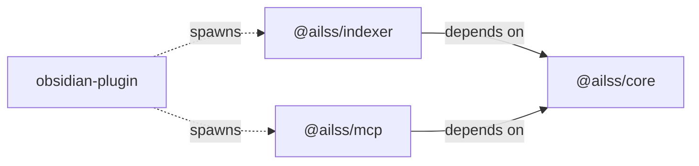
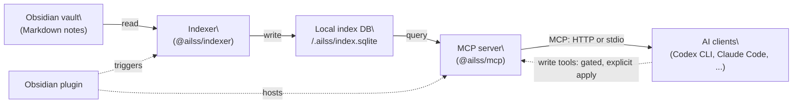
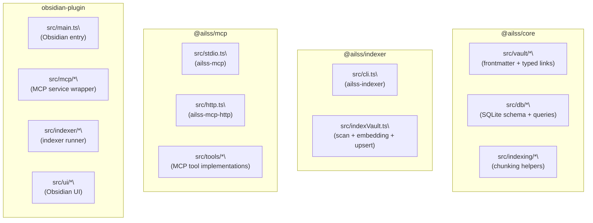

# AILSS

**Actionable Integrated Linked Semantic System**.

AILSS helps you structure knowledge in Obsidian and work efficiently with AI.
Your Obsidian vault is the single source of truth.

AILSS connects AI tooling to an Obsidian vault by building a local index database and exposing retrieval tools over MCP.

## Problem

AILSS is not an agent-owned memory layer.
Instead, it keeps context in your vault: notes you can read, edit, and maintain.
AI tools consult that context through explicit, auditable retrieval over MCP.
By default, tools are read-only; any writes are gated and require an explicit apply.

## Three-Layer Architecture

### Package structure (monorepo)



### Runtime flow



### Code structure



## Quickstart

1. Download `ailss-<ver>.zip` from GitHub Releases.
2. Extract it into `<Vault>/.obsidian/plugins/ailss-obsidian/`.
3. Install bundled service dependencies once:

```bash
cd "<Vault>/.obsidian/plugins/ailss-obsidian/ailss-service"
pnpm install --prod
```

4. In Obsidian plugin settings, set your `OPENAI_API_KEY` and run **AILSS: Reindex vault**.
5. Enable the “MCP service (Codex, localhost)” setting and copy the token.

### Codex CLI

6. Add this to `~/.codex/config.toml` (replace `<token>`):

```toml
[mcp_servers.ailss]
url = "http://127.0.0.1:31415/mcp"
http_headers = { Authorization = "Bearer <token>" }
```

### Claude Code

6. Add the MCP server in Claude Code:

```json
{
  "mcpServers": {
    "ailss": {
      "type": "http",
      "url": "http://127.0.0.1:31415/mcp",
      "headers": {
        "Authorization": "Bearer ${AILSS_MCP_BEARER_TOKEN}"
      }
    }
  }
}
```

Set `AILSS_MCP_BEARER_TOKEN` to the token from step 5.

## How it works

AILSS writes a local index DB at `<vault>/.ailss/index.sqlite` and serves retrieval over an MCP endpoint hosted by the Obsidian plugin.

This setup lets Codex connect over HTTP without needing direct vault filesystem permissions.

### Vault model

AILSS treats your vault as a knowledge graph:

- YAML frontmatter: structured note metadata.
  - Required keys: `id` (`YYYYMMDDHHmmss`, derived from `created`), `created`, `title`, `summary`, `aliases`, `entity`, `layer`, `tags`, `keywords`, `status`, `updated`, `source`.
- Typed links: frontmatter keys of wikilinks for semantic relations (graph edges).
  - Common keys: `instance_of`, `part_of`, `depends_on`, `uses`, `implements`, `cites`, `authored_by`, `same_as`, `supersedes`.

Full rules: `docs/standards/vault/README.md`.

## MCP tools

Full reference: `docs/01-overview.md` and `docs/reference/mcp-tools.md`.

- Read tools: `get_context`, `expand_typed_links_outgoing`, `resolve_note`, `read_note`, `search_notes`, `list_tags`, `list_keywords`, `find_broken_links`, `frontmatter_validate`, `find_typed_links_incoming`, `get_tool_failure_report`
- Write tools (gated): `capture_note`, `canonicalize_typed_links`, `edit_note`, `improve_frontmatter`, `relocate_note`  
  Requires `AILSS_ENABLE_WRITE_TOOLS=1` and `apply=true`.

## Docs

- `docs/README.md`: documentation index
- `docs/01-overview.md`: architecture + MCP tool surface
- `docs/ops/codex-cli.md`: Codex CLI setup
- `docs/ops/local-dev.md`: local development
- `docs/standards/vault/README.md`: vault model and rules

## Prompts and Skill

- Vault prompt: use **Prompt installer (vault root)** to write `AGENTS.md` at your vault root.
- Agent Skill: use **Copy Prometheus Agent Skill** and install it in your terminal AI client’s skill directory (for example, Codex CLI uses `~/.codex/skills/ailss-prometheus-agent/SKILL.md`).
