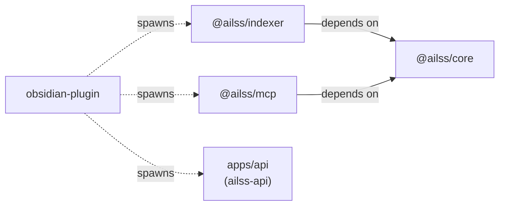
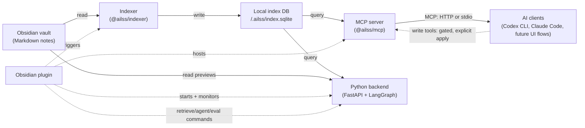
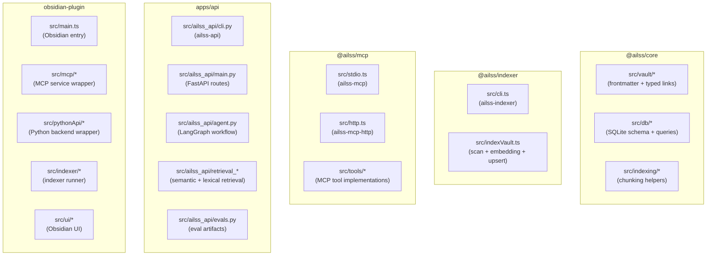

# AILSS

**Actionable Integrated Linked Semantic System**.

AILSS is a local-first knowledge backend for Obsidian that is moving toward a Python-first
agent runtime. Your Obsidian vault remains the single source of truth.

Today, AILSS ships a Node/TypeScript indexer, MCP server, and Obsidian plugin. The next
baseline keeps the plugin as the local UX shell, keeps the current Node packages as the
transition layer, and adds a Python-first backend surface for retrieval, agent
orchestration, evaluation, and lightweight observability.

## What AILSS Solves

AILSS is not an agent-owned memory layer.
Instead, it keeps context in your vault: notes you can read, edit, and maintain.
AI tools consult that context through explicit, auditable retrieval over MCP.
By default, tools are read-only; any writes are gated and require an explicit apply.

For this phase, the product boundary stays local-first and single-user. Remote hosting,
multi-tenant SaaS concerns, and heavy cloud-first infrastructure are intentionally out of
scope.

## Baseline Direction

- Obsidian plugin: local UX shell and launcher
- Node/TypeScript packages: current indexing, MCP transport, and gated write baseline
- Python backend: implemented FastAPI surface for `/health`, `/retrieve`, `/agent/run`, and
  `/eval/run`, with plugin-managed lifecycle and shutdown
- Migration rule: incremental replacement only, with existing local retrieval and explicit
  write safety preserved

Architecture and API contract: `docs/architecture/python-first-local-agent-backend.md`.

## Architecture

Transition runtime (current baseline):

### Package structure (monorepo)


```mermaid
flowchart LR
  core["@ailss/core"]
  indexer["@ailss/indexer"]
  mcp["@ailss/mcp"]
  api["apps/api<br/>(ailss-api)"]
  plugin["obsidian-plugin"]

  indexer -->|depends on| core
  mcp -->|depends on| core

  plugin -.->|spawns| indexer
  plugin -.->|spawns| mcp
  plugin -.->|spawns| api
```

### Runtime flow


```mermaid
flowchart LR
  vault["Obsidian vault<br/>(Markdown notes)"]
  db["Local index DB<br/><vault>/.ailss/index.sqlite"]

  indexer["Indexer<br/>(@ailss/indexer)"]
  mcpServer["MCP server<br/>(@ailss/mcp)"]
  pythonApi["Python backend<br/>(FastAPI + LangGraph)"]
  clients["AI clients<br/>(Codex CLI, Claude Code, future UI flows)"]
  obsidian["Obsidian plugin"]

  vault -->|read| indexer -->|write| db
  db -->|query| mcpServer -->|MCP: HTTP or stdio| clients
  db -->|query| pythonApi
  vault -->|read previews| pythonApi

  obsidian -.->|triggers| indexer
  obsidian -.->|hosts| mcpServer
  obsidian -.->|starts + monitors| pythonApi
  obsidian -.->|retrieve/agent/eval commands| pythonApi
  clients -.->|write tools: gated, explicit apply| mcpServer
```

### Code structure


```mermaid
flowchart TB
  subgraph core["@ailss/core"]
    core_vault["src/vault/*<br/>(frontmatter + typed links)"]
    core_db["src/db/*<br/>(SQLite schema + queries)"]
    core_indexing["src/indexing/*<br/>(chunking helpers)"]
  end

  subgraph indexer["@ailss/indexer"]
    indexer_cli["src/cli.ts<br/>(ailss-indexer)"]
    indexer_flow["src/indexVault.ts<br/>(scan + embedding + upsert)"]
  end

  subgraph mcp["@ailss/mcp"]
    mcp_stdio["src/stdio.ts<br/>(ailss-mcp)"]
    mcp_http["src/http.ts<br/>(ailss-mcp-http)"]
    mcp_tools["src/tools/*<br/>(MCP tool implementations)"]
  end

  subgraph api["apps/api"]
    api_cli["src/ailss_api/cli.py<br/>(ailss-api)"]
    api_main["src/ailss_api/main.py<br/>(FastAPI routes)"]
    api_agent["src/ailss_api/agent.py<br/>(LangGraph workflow)"]
    api_retrieval["src/ailss_api/retrieval_*<br/>(semantic + lexical retrieval)"]
    api_eval["src/ailss_api/evals.py<br/>(eval artifacts)"]
  end

  subgraph plugin["obsidian-plugin"]
    plugin_main["src/main.ts<br/>(Obsidian entry)"]
    plugin_mcp["src/mcp/*<br/>(MCP service wrapper)"]
    plugin_python["src/pythonApi/*<br/>(Python backend wrapper)"]
    plugin_indexer["src/indexer/*<br/>(indexer runner)"]
    plugin_ui["src/ui/*<br/>(Obsidian UI)"]
  end
```

## Quickstart

1. Download `ailss-<ver>.zip` from GitHub Releases.
2. Extract it into `<Vault>/.obsidian/plugins/ailss-obsidian/`.
3. Install bundled service dependencies once:

```bash
cd "<Vault>/.obsidian/plugins/ailss-obsidian/ailss-service"
pnpm install --prod
```

4. If you want the Python backend commands, install Python 3.12+ and `uv`.
   The release bundle already includes `ailss-service/apps/api` for the default Python backend path.
5. In Obsidian plugin settings, set your `OPENAI_API_KEY` and run **AILSS: Reindex vault**.
6. Enable the “Python backend (local)” setting if you want retrieval, agent, and eval
   commands inside Obsidian.
7. Enable the “MCP service (Codex, localhost)” setting and copy the token.

### Codex CLI

8. Add this to `~/.codex/config.toml` (replace `<token>`):

```toml
[mcp_servers.ailss]
url = "http://127.0.0.1:31415/mcp"
http_headers = { Authorization = "Bearer <token>" }
```

### Claude Code

8. Add the MCP server in Claude Code:

```json
{
  "mcpServers": {
    "ailss": {
      "type": "http",
      "url": "http://127.0.0.1:31415/mcp",
      "headers": {
        "Authorization": "Bearer ${AILSS_MCP_BEARER_TOKEN}"
      }
    }
  }
}
```

Set `AILSS_MCP_BEARER_TOKEN` to the token from step 7.

### Obsidian Python backend commands

After enabling the local Python backend, the plugin exposes these commands:

- `AILSS: Check Python backend health`
- `AILSS: Retrieve with Python backend`
- `AILSS: Ask Python backend agent`
- `AILSS: Run Python backend eval`

The current agent path is a grounded local baseline: semantic retrieval + LangGraph
workflow + deterministic answer synthesis with inspectable citations.

## How it works

AILSS writes a local index DB at `<vault>/.ailss/index.sqlite`, serves MCP over the
Obsidian-managed Node service, and can also start a local Python backend for retrieval,
agent execution, evaluation, and run artifacts.

This setup lets Codex connect over HTTP without needing direct vault filesystem permissions.

### Vault model

AILSS treats your vault as a knowledge graph:

- YAML frontmatter: structured note metadata.
  - Required keys: `id` (`YYYYMMDDHHmmss`, derived from `created`), `created`, `title`, `summary`, `aliases`, `entity`, `layer`, `tags`, `keywords`, `status`, `updated`, `source`.
- Typed links: frontmatter keys of wikilinks for semantic relations (graph edges).
  - Common keys: `instance_of`, `part_of`, `depends_on`, `uses`, `implements`, `cites`, `authored_by`, `same_as`, `supersedes`.

Full rules: `docs/standards/vault/README.md`.

## MCP tools

Full reference: `docs/01-overview.md` and `docs/reference/mcp-tools.md`.

- Read tools: `get_context`, `expand_typed_links_outgoing`, `resolve_note`, `find_typed_links_incoming`, `list_typed_link_rels`, `read_note`, `get_vault_tree`, `frontmatter_validate`, `find_broken_links`, `search_notes`, `list_tags`, `list_keywords`, `get_tool_failure_report`
- Write tools (gated): `capture_note`, `canonicalize_typed_links`, `edit_note`, `improve_frontmatter`, `relocate_note`  
  Requires `AILSS_ENABLE_WRITE_TOOLS=1` and `apply=true`.

## Docs

- `docs/README.md`: documentation index
- `docs/01-overview.md`: architecture + MCP tool surface
- `docs/architecture/python-first-local-agent-backend.md`: transition baseline, service boundaries, API contract
- `docs/ops/codex-cli.md`: Codex CLI setup
- `docs/ops/local-dev.md`: local development
- `docs/standards/vault/README.md`: vault model and rules
- `docs/reference/mcp-tools.md`: MCP tools reference

## Prompts and Skill

- Vault prompt: use **Prompt installer (vault root)** to write `AGENTS.md` at your vault root.
- Agent Skill: use **Copy Prometheus Agent Skill** and install it in your terminal AI client’s skill directory (for example, Codex CLI uses `~/.codex/skills/ailss-prometheus-agent/SKILL.md`).
