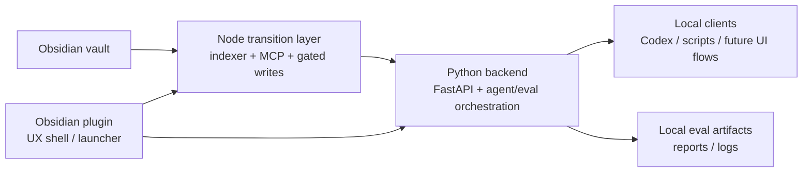

# Architecture: Python-first local agent backend baseline

This document records the baseline direction established by issue #175.

It does not require a full runtime rewrite. Instead, it defines the target service
boundaries, the first local API contract, and the acceptance criteria for the next phase of
AILSS.

## Goals

- Reposition AILSS as a Python-first local agent backend for personal knowledge workflows.
- Keep Obsidian as the user-facing shell and launcher.
- Preserve the current local-first boundary, explicit write safety, and existing retrieval
  assets.
- Add a clear backend contract for retrieval, agent execution, evaluation, and lightweight
  observability.

## Non-goals

- Multi-tenant SaaS architecture
- Remote hosting or cloud-first infrastructure expansion
- Mandatory Redis, queue workers, or background job systems for the baseline milestone
- Replacing the current Node/TypeScript packages before equivalent behavior exists

## Baseline rule

- Obsidian plugin stays the local UX shell.
- Existing Node/TypeScript packages stay in place as the transition baseline for indexing,
  MCP transport, and gated vault writes.
- A new local FastAPI service becomes the Python-first backend surface.
- Migration remains incremental. New Python paths should reuse the current local index and
  vault model whenever practical instead of forcing a rewrite.

## Service boundaries



### Obsidian plugin

Responsibilities:

- Local UX shell and launcher
- User-facing settings, status, and token/config management
- Explicit write approval surface
- Starting and supervising local services needed for the desktop workflow

Constraints:

- Should not become the main agent orchestration layer
- Should preserve explicit/gated write behavior for vault changes

### Node/TypeScript transition layer

Current packages:

- `packages/core`
- `packages/indexer`
- `packages/mcp`
- `packages/obsidian-plugin`

Responsibilities during transition:

- Maintain the indexed local note/chunk model
- Keep MCP transport stable for existing Codex and Obsidian flows
- Keep gated write tools as the safe mutation boundary
- Continue to support local retrieval while Python equivalents are added

Constraints:

- Remains the working baseline, not the final orchestration surface
- Should expose stable data and tool boundaries that Python can reuse

### Python backend

Planned repo location:

- `apps/api`

Responsibilities:

- Expose the local FastAPI contract
- Own retrieval orchestration for Python-side agent flows
- Own the primary agent workflow path
- Own evaluation execution and result reporting
- Record lightweight observability artifacts such as run outcomes, latency summaries, and
  token/cost summaries when available

Constraints:

- Must stay local-first and single-user in this phase
- Must preserve explicit failure reporting
- Must not silently broaden write authority beyond the existing gated model

## Initial API contract

### `GET /health`

Purpose:

- Liveness and local dependency checks

Response shape:

```json
{
  "status": "ok",
  "service": "ailss-api",
  "version": "0.1.0-dev",
  "checks": {
    "vault_configured": true,
    "index_db_ready": true
  }
}
```

Failure expectation:

- Return a non-`ok` status and explicit check values when local prerequisites are missing.

### `POST /retrieve`

Purpose:

- Python-side retrieval entrypoint that reuses the existing local index and vault model

Request shape:

```json
{
  "query": "How is AILSS positioned for agent backend work?",
  "top_k": 5,
  "path_prefix": "docs/",
  "tags_any": ["architecture"],
  "tags_all": []
}
```

Response shape:

```json
{
  "status": "ok",
  "query": "How is AILSS positioned for agent backend work?",
  "results": [
    {
      "path": "docs/03-plan.md",
      "score": 0.91,
      "evidence": [
        {
          "chunk_id": "docs/03-plan.md#11",
          "text": "Reposition AILSS as a Python-first local LLM agent backend..."
        }
      ]
    }
  ],
  "warnings": []
}
```

Failure expectation:

- Missing index or unsupported scope filters should fail explicitly rather than silently
  degrading to unrelated retrieval.

### `POST /agent/run`

Purpose:

- Execute the core local agent workflow

Request shape:

```json
{
  "input": "Summarize the Python-first backend direction for this repo.",
  "session_id": "local-dev",
  "apply": false,
  "context": {
    "path_prefix": "docs/"
  }
}
```

Response shape:

```json
{
  "status": "ok",
  "run_id": "run_123",
  "outcome": "completed",
  "answer": "AILSS is moving toward a Python-first local agent backend while keeping Obsidian as the UX shell.",
  "citations": [
    {
      "path": "docs/03-plan.md",
      "chunk_id": "docs/03-plan.md#11"
    }
  ],
  "failure": null,
  "write_actions": []
}
```

Required explicit failure codes:

- `missing_context`
- `ambiguous_note_resolution`
- `grounding_failure`
- `write_not_allowed`
- `apply_not_requested`

### `POST /eval/run`

Purpose:

- Run a reproducible local evaluation pass for retrieval and agent behavior

Request shape:

```json
{
  "dataset_id": "golden-local-baseline",
  "limit": 25,
  "record_artifacts": true
}
```

Response shape:

```json
{
  "status": "ok",
  "run_id": "eval_123",
  "summary": {
    "cases_total": 25,
    "cases_passed": 21,
    "latency_ms_p50": 420
  },
  "artifact_dir": ".ailss/evals/eval_123"
}
```

Failure expectation:

- Missing dataset/config should fail with a clear error instead of running a partial or
  implicit fallback evaluation.

## Acceptance criteria

- AILSS can be explained clearly as a Python-first local agent backend with Obsidian as the
  user-facing shell.
- A local API can run end-to-end for health, retrieval, and at least one agent workflow.
- The repo contains a reproducible local evaluation path and at least one inspectable result
  summary.
- The docs clearly define service boundaries between the plugin, Node transition layer, and
  Python backend.
- Local-first, single-user scope and explicit write safety remain non-negotiable project
  boundaries for this phase.
